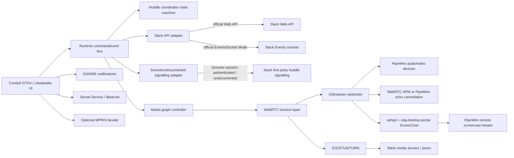

# Deep research report on adding Slack huddles to Conduit on GNOME Debian 13

## Executive summary

A native huddles implementation in Conduit is **technically feasible on reasonably current GNOME Linux**, but the feasibility splits cleanly into two very different parts. The **local Linux/GNOME/media work is well-supported**: Slack publicly states that huddles use the WebRTC standard, encrypt media with SRTP using DTLS-SRTP, encrypt data channels with DTLS, and use HTTPS or secure WebSockets with TLS 1.2 for signalling. On the desktop side, Debian 13 provides the core stack you want for a native GNOME client: PipeWire 1.4.2, xdg-desktop-portal 1.20.3, xdg-desktop-portal-gnome 48.0-2, WirePlumber 0.5.8, and GStreamer 1.26.x packages including `gstreamer1.0-pipewire` and the “bad” plugin set that contains `webrtcbin`. citeturn45view0turn34view0turn34view1turn35view0turn33view0turn16search13

The **hard part is not audio/video on Linux**. It is **Slack’s first-party huddle signalling and join/bootstrap flow**, because Slack does not document public Web API methods for starting or joining Slack’s own huddles. Slack does document adjacent pieces: conversation objects may represent a huddle, and the `user_huddle_changed` event exposes huddle-related profile fields such as `huddle_state`, `huddle_state_expiration_ts`, and `huddle_state_call_id`. Slack also documents the external **Calls API**, but that API is for integrating a third-party call provider into Slack’s UI, not for driving Slack’s own huddle media plane. That means your implementation must assume that **official APIs are enough for discovery and presence**, but **not enough for end-to-end huddle participation**. citeturn27view0turn27view1turn30search8turn30search1turn30search15

My recommendation is therefore a **two-track architecture**. First, build a **clean native media stack** around **GStreamer `webrtcbin` + PipeWire + the ScreenCast portal + optional in-process WebRTC audio processing**. Second, isolate **Slack-specific huddle signalling** behind a narrow adapter layer that can consume official events where available and browser-session-authenticated or otherwise undocumented first-party client calls where necessary. Conduit already appears well positioned for this: its codebase has a central `SlackApi` in `src/slack.rs`, a dedicated Socket Mode/WebSocket layer in `src/socket_mode.rs`, a runtime command/event bus in `src/runtime.rs`, and UI/event consumption concentrated in `src/window.rs`. It also already has a browser-session path with `xoxc_token`, `xoxd_token`, persisted browser cookie state, and user-agent handling, which is exactly the kind of credential surface that a first-party-like huddle bootstrap is likely to require. citeturn12view0turn41view0turn41view1turn39view3

For the **media engine choice**, the strongest fit for a native Rust GNOME app on Debian 13 is **GStreamer + `webrtcbin`**, not Google’s native `libwebrtc`, and not server technologies such as Janus or mediasoup. `webrtcbin` already exposes offer/answer, ICE, STUN/TURN, transceivers, data channels, and tunable latency, and Debian 13 ships the surrounding multimedia packages cleanly. `libwebrtc` is powerful but heavy, packaging-hostile, and poorly aligned with GNOME/GObject conventions. Janus and mediasoup are excellent **test harnesses** or **reference SFUs**, but wrong as an in-process client stack. Pion is a high-quality Go stack, but it is a poor fit for an otherwise Rust/GTK application unless you are willing to run a sidecar process. citeturn21view4turn22view0turn22view1turn22view2turn22view3turn14search3turn15search0turn14search2turn15search1

For **screen sharing**, the correct GNOME path is straightforward: use the **ScreenCast portal** session lifecycle (`CreateSession` → `SelectSources` → `Start` → `OpenPipeWireRemote`), consume the PipeWire remote via PipeWire or GStreamer, and prefer the stream’s `pipewire-serial`/`object.serial` over the deprecated node ID when targeting streams. On Wayland this is essential; on X11 it is still the right default because it yields consistent permissions UX, better future-proofing, and compatibility with sandboxed packaging. The Rust crate **`ashpd`** is a very strong fit here and already documents the exact screencast flow you need. citeturn21view0turn37view2turn21view1

The overall delivery plan should be **phased**. Phase one should prove protocol viability with **join/listen/mute/unmute/audio-only**. Phase two should add **camera video**. Phase three should add **screen share via portal/PipeWire**. Phase four should harden reconnects, permissions UX, performance, and CI. If Slack’s private huddle bootstrap proves unstable or strongly Chromium-specific, your best practical fallback is **“open huddle in the user’s browser/Slack desktop client”**, not trying to repurpose Slack’s Calls API. As a last-resort experimental fallback, browser automation plus PipeWire virtual devices is possible and is already demonstrated by at least one open-source project, but that should remain outside the mainline design because it is brittle and expensive to maintain. citeturn30search8turn24search2turn20view3

## What Slack exposes and what remains private

Slack’s published material gives you enough to establish the **outer shape** of huddles, but not a complete implementation contract. The strongest official statement is Slack’s own security note: huddles use **WebRTC**, media is encrypted with **SRTP using DTLS-SRTP**, data channels use **DTLS**, and signalling uses **HTTPS or secure WebSockets over TLS 1.2**. Slack’s network/system guidance adds that huddles require microphone/camera/screen-recording access, benefit from hardware acceleration, and rely on **AV1, VP9, and H.264** video codecs. Slack also advises avoiding VPN/proxy/DPI interference and suggests audio-only in resource-constrained VDI environments. Together, those statements strongly support the conclusion that a native WebRTC-capable Linux client is the right technical direction. citeturn45view0turn20view0turn20view1turn20view2turn20view3

Slack’s **official developer APIs** expose some huddle-related state, but not a public “join this huddle” or “negotiate this huddle” API. The conversation object can represent a **huddle**; the event `user_huddle_changed` is delivered to Events API and RTM consumers; and its payload includes huddle-specific profile fields such as `huddle_state`, `huddle_state_expiration_ts`, and `huddle_state_call_id`. That gives you a public, supportable way to detect and reflect huddle presence in the UI, map a user to an active huddle identifier, and potentially correlate roster state. It does **not** give you the signalling steps needed to establish media. citeturn27view0turn27view1

Slack’s **Socket Mode** is relevant because it is Slack’s current WebSocket delivery mechanism for Events API and interactive payloads. It is established by calling `apps.connections.open` with an app-level token carrying `connections:write`, after which Slack returns a temporary WebSocket URL. The socket yields a `hello` event, refresh/disconnect messages, and per-event envelopes that must be acknowledged with `envelope_id`. Slack explicitly says that new apps may not use RTM and recommends Socket Mode instead. This is useful for **official event intake**, but it should not be confused with the private huddle media/signalling channel used by Slack’s own first-party clients. citeturn29view0turn30search0turn30search2turn31view0turn31view1turn31view2turn29view1

Slack’s **Calls API** is the most important “near miss” to understand. Slack documents it as the way to integrate **your own calling service** into Slack so it appears natively with a join button and participant list. The associated scopes are `calls:read` and `calls:write`. That is valuable context, but it is **not** a public API for Slack huddles themselves. In other words, it helps you understand Slack’s external-call integration model, but it should not anchor your huddles implementation plan. citeturn30search8turn30search1turn30search15

For Conduit specifically, the codebase already suggests that the app can work beyond ordinary bot-style Slack APIs. `src/slack.rs` defines a `SlackApi` that stores an access token, optional browser cookie state, and optional user-agent string. `src/runtime.rs` also contains a `StartBrowserSession` command with `xoxc_token`, `xoxd_token`, and an optional user agent. That matters because the most realistic hypothesis is that Slack’s huddle bootstrap is a **first-party client flow** requiring **browser-session-authenticated** requests or WebSocket traffic, not just ordinary public app scopes. I would therefore treat official Events/Web APIs as the **control-plane supplement**, and the browser-session path as the likely **bootstrap path** for huddles. That is an inference, but it is the inference most strongly supported by the sources. citeturn12view0turn41view0turn27view1

An abridged official Socket Mode flow looks like this:

```json
// HTTP: POST slack.com/api/apps.connections.open
// Auth: Bearer xapp-... with connections:write

{ "ok": true, "url": "wss://wss.slack.com/link/?ticket=..." }

// WebSocket server greeting
{ "type": "hello", "connection_info": { "app_id": "A1234" }, "num_connections": 1 }

// Event envelope
{
  "payload": { "event": { "type": "user_huddle_changed", "...": "..." } },
  "envelope_id": "uuid",
  "type": "events_api",
  "accepts_response_payload": false
}

// ACK
{ "envelope_id": "uuid" }
```

That flow is official and reliable for Slack events. Your huddle implementation should reuse its event demultiplexing patterns, but it should assume that **actual media-session bootstrap remains an undocumented layer** to be learned empirically and insulated behind a dedicated adapter. citeturn29view0turn31view0turn31view1turn31view2turn27view1

## Recommended architecture

The architecture I recommend is intentionally split between a **stable native media core** and an **unstable Slack-specific signalling edge**. That separation will let you continue using the same PipeWire, portal, AEC, codec, and UI code even if Slack changes an internal endpoint or WebSocket schema. citeturn45view0turn21view4turn21view0turn12view0



### Architecture decision

The best primary implementation path is:

- **Use `GStreamer webrtcbin`** as the media engine.
- **Use PipeWire** as the local media device and screencast transport.
- **Use `ashpd`** for ScreenCast portal orchestration from Rust.
- **Use in-process WebRTC audio processing** for AEC/AGC/NS where you need deterministic per-call behaviour, while still allowing the user to pick PipeWire virtual echo-cancel devices if they already use them.
- Keep **Slack signalling in a swappable adapter** with a feature flag and detailed instrumentation. citeturn21view4turn22view0turn22view1turn22view2turn22view3turn37view2turn13search2turn33view5

### Media stack options

| Option | Fit for native Rust GNOME client | Strengths | Weaknesses | Recommendation |
|---|---|---|---|---|
| **GStreamer + `webrtcbin`** | Excellent | Native fit for GTK/GObject environments; explicit SDP/ICE/STUN/TURN controls; Rust bindings available; Debian packages are cleanly available. citeturn21view4turn22view0turn22view1turn23search4turn35view0 | You own signalling and some call-state logic; debugging SDP quirks takes effort. citeturn21view4turn22view3 | **Best primary choice** |
| **Google `libwebrtc`** | Moderate to poor | Most battle-tested browser-grade media stack; strong A/V quality. citeturn15search1turn15search5 | Heavy dependency graph, awkward packaging, harder Rust/GTK integration, application developers are encouraged to prefer the WebRTC API rather than native package directly. citeturn15search1turn15search5 | Reserve for last resort |
| **`libdatachannel`** | Moderate | Smaller C/C++ library with C bindings; includes WebRTC media transport and WebSockets. citeturn14search1turn14search5 | Less aligned with GNOME multimedia plumbing; you do more media-device work yourself. citeturn14search1turn14search5 | Good contingency option |
| **Pion WebRTC** | Poor in-process fit | Mature WebRTC API in Go; fast iteration. citeturn14search2turn14search6 | Best suited to Go services or sidecars, not a direct Rust GTK app. citeturn14search2turn14search6 | Use only as a helper process if absolutely necessary |
| **Janus** | Poor as client, strong as harness | General-purpose WebRTC server, excellent for interop labs and SDP/ICE testing. citeturn14search3turn14search7 | It is a server, not the in-app client stack you need. citeturn14search3turn14search7 | Use as test scaffold only |
| **mediasoup** | Poor as client, strong as harness | Excellent SFU ecosystem and docs; good for conference back-end modelling. citeturn15search0turn15search4 | Again, a server-side conferencing stack, not a local desktop client library. citeturn15search0turn15search4 | Use for reference/interoperability, not Conduit runtime |

### Signalling and transport choice

You should design for **WebRTC media transport** and **Slack-specific signalling**. Slack’s own help centre confirms WebRTC and DTLS/SRTP. GStreamer’s `webrtcbin` already maps well to SDP offer/answer and ICE. The natural inference is therefore: **do not invent a proprietary media stack**; instead, assume Slack’s proprietary element, if any, is mostly in **session bootstrap, signalling message schema, and auth**, not in RTP/SRTP fundamentals. citeturn45view0turn21view4

Concretely, the huddle adapter should expose an internal interface something like:

- `discover_active_huddle(channel_id | user_id) -> Option<HuddleRef>`
- `bootstrap_join(huddle_ref) -> SlackJoinSession`
- `get_offer_or_remote_description()`
- `send_local_description()`
- `add_remote_candidate()`
- `send_local_candidate()`
- `leave_session()`

That interface lets you survive a future migration from one undocumented Slack flow to another while keeping the rest of Conduit unchanged. The first build should expect the adapter to consume **browser-session-authenticated traffic**, because Conduit already has browser-session machinery and because Slack does not publish huddle join endpoints. citeturn12view0turn41view0turn27view1

## Linux and GNOME implementation details

### PipeWire, portals, permissions, and screen sharing

The GNOME-native screen-sharing path is unambiguous. The ScreenCast portal documentation defines a session-based DBus flow: `CreateSession`, `SelectSources`, `Start`, and then `OpenPipeWireRemote` to obtain a file descriptor for a restricted PipeWire remote containing the selected screencast streams. The portal currently documents interface version 6, supports monitor/window/virtual sources, and explicitly recommends using the stream’s `pipewire-serial`/`object.serial` rather than the deprecated node ID for targeting, because node IDs can be reused. PipeWire’s portal module documentation explains that the portal owns a privileged connection and hands clients a restricted one. citeturn21view0turn21view1

For Rust, `ashpd` is the cleanest fit. Its screencast module already shows exactly the flow you need: create a session, select source types and cursor mode, start the session, and consume the returned PipeWire stream information. Because Conduit is a native Rust GNOME app, `ashpd` is a better ergonomic match than talking raw DBus to the portal by hand. citeturn37view2turn23search8

The practical GNOME behaviour should be:

- **Wayland**: always use the ScreenCast portal.
- **X11**: still default to the portal for a uniform permissions flow and to keep Flatpak-ready behaviour.
- Keep **portal activation scoped to user intent**. Do not ask for screen-cast permission until the user explicitly presses “Share screen”.
- Persist portal permissions only if you have a compelling UX reason; otherwise use non-persistent grants initially and add restore-token support later. The portal supports `persist_mode`, but least-surprise UX argues for conservative use in early versions. citeturn21view0

### Audio devices, AEC, AGC, latency, and codecs

PipeWire gives you the right Linux substrate for devices and graph routing, and Debian 13 ships both PipeWire and WirePlumber. PipeWire also documents an echo-cancel module intended for conferencing scenarios, and Debian ships a standalone `libwebrtc-audio-processing` development package that wraps the WebRTC AudioProcessing module for echo cancellation and gain control. My recommendation is to keep **two supported paths**: app-local WebRTC audio processing as the default behaviour you can test deterministically, and PipeWire virtual echo-cancel devices as an advanced user selection. citeturn16search2turn17search0turn13search2turn13search13turn33view5

For codecs, there are two separate realities you need to support. Generic WebRTC interoperability expects at least **Opus** for audio and **VP8/H.264** for video in browser environments, while Slack specifically says huddles rely on **AV1, VP9, and H.264**. On Debian 13, the packaged codec/dependency situation is good: `libopus` 1.5.2, `libvpx` 1.15.0, `libopenh264` 2.6.0, and `libsrtp2` 2.7.0 are available. The operational recommendation is therefore:

- **Audio**: implement **Opus** robustly and first.
- **Video receive**: support **H.264, VP9, and AV1** if your chosen pipeline elements and distro runtime provide them.
- **Video send**: prioritise **H.264 and VP9** first; treat **AV1 encode** as opportunistic because real-time AV1 encode is materially more demanding on desktop hardware.
- Keep **VP8** available if your stack naturally includes it, because it remains an important generic WebRTC fallback even if Slack often prefers newer codecs. citeturn20view0turn15search2turn43view4turn43view1turn43view2turn43view3

GStreamer’s `webrtcbin` defaults its jitterbuffer latency to **200 ms**. That is a conservative default, not a conferencing target. For huddles, you should expose a tuned configuration path and empirically drive the steady-state audio/video target downward, but only after you have reconnection and jitter handling working. Slack itself says latency and jitter are relevant stored performance metrics, which aligns with prioritising instrumentation before trying to shave every millisecond. citeturn22view3turn45view0

### NAT traversal and TURN/STUN provider options

For actual Slack huddle sessions, the rule should be simple: **use the ICE/STUN/TURN servers Slack provides during bootstrap, and do not override them**. ICE exists to combine host, reflexive, and relayed candidates using STUN and TURN, and your client stack should fully support that machinery. Override providers only for **local harnesses**, **interop tests**, or if you build a synthetic test backend. citeturn19search0turn19search4turn22view0turn22view1

| Provider | Best use in this project | Pros | Cons |
|---|---|---|---|
| **Slack-provided ICE servers** | Real huddle sessions | Matches Slack’s expectations; zero config drift. citeturn45view0turn19search0 | Undocumented acquisition path; may change without notice. |
| **coturn** | Local testbed / CI / synthetic backend | Mature open-source TURN/STUN server; suitable for WebRTC long-term credentials and auth-secret approaches. citeturn19search3turn44search3turn44search7 | You operate it yourself; not for overriding Slack production sessions. |
| **Twilio NTS** | External test environments | Managed globally distributed STUN/TURN; credential API is documented. citeturn44search0turn44search4 | Ongoing cost and external dependency. |
| **Cloudflare Realtime TURN** | External test environments | Managed TURN, simple commercial path, especially with Cloudflare realtime stack. citeturn44search1turn44search5 | Less reason to adopt unless you already use Cloudflare Realtime. |

### GNOME notifications and MPRIS

GNOME notifications should be a **first-class** part of the implementation. GNOME documents that persistent notifications depend on using `GApplication`/`GtkApplication`, a valid desktop file matching the application ID, and D-Bus activation. Conduit is already a native GNOME app, so this is a natural fit for **incoming huddle invite**, **mic muted**, **screen share started**, and **reconnect needed** notifications. citeturn21view2

MPRIS is different. The spec is a D-Bus interface intended for media player discovery and playback control. You *can* expose an MPRIS object, but huddles are not a particularly natural semantic match for “play”, “pause”, “track”, or “playlist”. My recommendation is therefore to treat MPRIS as **optional and low priority**. If you implement it at all, keep it minimal and read-only for shell discoverability rather than trying to force call semantics onto transport controls. citeturn21view3

## Conduit integration plan

### Where to integrate in the existing codebase

From the repository structure and file roles visible on GitHub, Conduit already has the right seams for this work. `src/slack.rs` is the central API layer; `src/socket_mode.rs` is the WebSocket/events side; `src/runtime.rs` already defines a command/event bus with `RuntimeCommand` and `RuntimeEventKind`; `src/window.rs` is the main event-driven UI/controller layer; and `src/services/` already hosts service-style modules. The Meson build simply invokes Cargo, so new Rust modules are the main integration cost rather than Meson complexity. citeturn9view0turn10view0turn41view0turn41view1turn39view3turn38view0turn38view1

I would add these modules:

```text
src/huddles/mod.rs
src/huddles/model.rs
src/huddles/signaling.rs
src/huddles/media.rs
src/huddles/portal.rs
src/huddles/devices.rs
src/huddles/aec.rs
src/huddles/state.rs
```

And I would extend these existing files:

- `src/slack.rs` with `SlackHuddleApi` or huddle bootstrap helpers.
- `src/socket_mode.rs` with official huddle-relevant event subscriptions and parsers.
- `src/runtime.rs` with huddle commands/events.
- `src/window.rs` with huddle controls, permissions flow, and status indicators.
- `src/workspace_state.rs` with persistent per-workspace huddle UI state if needed. citeturn12view0turn41view0turn41view1turn40view1turn39view3

### Recommended new runtime contract

`src/runtime.rs` already has a command/event pattern that is ideal for huddles. Add commands such as:

- `DiscoverHuddle { channel_id }`
- `JoinHuddle { huddle_id }`
- `LeaveHuddle`
- `SetMicMuted { muted }`
- `SetCameraEnabled { enabled }`
- `StartScreenShare`
- `StopScreenShare`
- `SelectAudioInput { device_id }`
- `SelectAudioOutput { device_id }`
- `SelectVideoInput { device_id }`

And events such as:

- `HuddleDiscovered(HuddleSummary)`
- `HuddleJoinFailed(RuntimeFailure)`
- `HuddleStateChanged(HuddleState)`
- `HuddleRosterChanged(Vec<HuddleParticipant>)`
- `HuddleMediaStats(HuddleStats)`
- `ScreenSharePortalPrompted`
- `ScreenShareStarted`
- `ScreenShareStopped`

That design matches the existing `RuntimeCommand`/`RuntimeEventKind` pattern rather than fighting it. citeturn41view0turn41view1

### Concrete implementation sequence

The most efficient order is:

- **Protocol reconnaissance and adapter stub**
  - Add `huddles/signaling.rs`.
  - Consume official `user_huddle_changed` and conversation data first.
  - Correlate `huddle_state_call_id` with UI-visible active huddles.
  - Instrument every unknown Slack response/message exhaustively, but never log credentials. citeturn27view1turn27view0turn12view0

- **Audio-only proof of concept**
  - Add `huddles/media.rs` with `webrtcbin`.
  - Implement Opus send/receive.
  - Implement mute/unmute and device selection.
  - Add latency/jitter/packet-loss stats plumbing. citeturn21view4turn22view3turn43view4turn45view0

- **Video camera path**
  - Add local camera source and negotiated sendrecv transceivers.
  - Implement H.264/VP9 receive and H.264/VP9 transmit before AV1 encode.
  - Add hardware-acceleration detection and user-facing fallback to audio-only when acceleration is absent. citeturn20view0turn20view2turn43view1turn43view2

- **Screen sharing**
  - Add `huddles/portal.rs` and `huddles/devices.rs`.
  - Drive portal flow through `ashpd`.
  - Feed the resulting PipeWire stream into the GStreamer graph as the screen-share track.
  - Keep screen-share permission prompts strictly user-initiated. citeturn21view0turn37view2turn33view3

- **Hardening**
  - Reconnect logic for Socket Mode-style refresh/disconnect patterns.
  - Graceful media teardown on portal-session closure.
  - UI indicators for hot mic, hot camera, active share, degraded network, and codec fallback. citeturn31view1turn31view2turn21view0

### Libraries and versions to use

For a Debian 13 baseline as of **2026-07-18**, I recommend:

- **Runtime packages**
  - PipeWire / `gstreamer1.0-pipewire`: **1.4.2**
  - WirePlumber: **0.5.8**
  - xdg-desktop-portal: **1.20.3**
  - xdg-desktop-portal-gnome: **48.0-2**
  - GStreamer “bad” plugins: **1.26.2** package family on Debian 13 security updates. citeturn35view0turn33view0turn34view0turn34view1turn16search13

- **Rust crates**
  - `ashpd`: **0.13.13**
  - `gstreamer`: **0.25.3**
  - `gstreamer_webrtc`: **0.25.2** citeturn37view2turn37view0turn37view1

- **Codec / RTC dependencies**
  - `libopus`: **1.5.2**
  - `libvpx`: **1.15.0**
  - `libopenh264`: **2.6.0**
  - `libsrtp2`: **2.7.0**
  - `libwebrtc-audio-processing`: **1.3**
  - `libnice`: **0.1.22** package family in Debian 13. citeturn43view4turn43view1turn43view2turn43view3turn33view5turn43view0

### Debian build dependencies and build instructions

A sensible Debian 13 development bootstrap is:

```bash
sudo apt install \
  build-essential cargo rustc pkg-config meson ninja-build \
  libgtk-4-dev libadwaita-1-dev libwebkitgtk-6.0-dev libsecret-1-dev \
  libgstreamer1.0-dev libgstreamer-plugins-base1.0-dev libgstreamer-plugins-bad1.0-dev \
  gstreamer1.0-plugins-base gstreamer1.0-plugins-good gstreamer1.0-plugins-bad \
  gstreamer1.0-libav gstreamer1.0-pipewire \
  libpipewire-0.3-dev libspa-0.2-dev \
  xdg-desktop-portal xdg-desktop-portal-gnome wireplumber \
  libnice-dev libsrtp2-dev libopus-dev libvpx-dev libopenh264-dev \
  libwebrtc-audio-processing-dev
```

Those package names align with Debian 13’s GTK4/WebKitGTK 6, PipeWire/portal, and RTC/media packaging. `libsecret-1-dev` is relevant for secure token storage; `gstreamer1.0-pipewire` bridges GStreamer to PipeWire; `libnice-dev`, `libsrtp2-dev`, `libopus-dev`, `libvpx-dev`, and `libopenh264-dev` cover the core RTC stack; and `libwebrtc-audio-processing-dev` gives you a packaged AEC/AGC option. citeturn42search0turn42search2turn42search3turn35view0turn33view1turn33view2turn33view0turn43view0turn43view3turn43view4turn43view1turn43view2turn33view5

Conduit’s Meson files show that the project shells out to Cargo and provides a `cargo test` Meson test target. A normal local build should therefore remain simple:

```bash
meson setup build -Dbuildtype=release
meson compile -C build
meson test -C build
```

If you add new Rust modules only, you should not need substantial Meson restructuring. citeturn38view0turn38view1

## Packaging, testing, UX flow, performance, and fallback

### UX and permission flow on GNOME

The user-facing flow should feel decisively GNOME-native:

1. User presses **Join huddle** in the conversation header or participant card.
2. Conduit shows a compact **pre-flight sheet** with mic, speaker, and camera selectors, plus a clear “camera off by default” choice.
3. If the user chooses screen share later, only then open the **portal chooser**.
4. Once connected, the header shows **persistent live indicators** for mic, camera, and share status.
5. GNOME notifications cover incoming-join failures, reconnect warnings, and invitation-style events.
6. Leaving a huddle tears down media immediately, closes the portal session, and wipes ephemeral ICE credentials and SDP state from memory. citeturn21view0turn21view2turn31view2

This flow is not just aesthetic. It is a privacy and trust requirement, because Slack’s own guidance makes clear that huddles require access to mic/camera/screen recording, and Slack’s security notes say huddle metadata and performance metrics are stored and that public/private IPs may be shared with peers in the same huddle. Conduit should therefore make device and sharing state impossible to miss. citeturn20view0turn45view0

### Testing and CI strategy

Your automated testing strategy should explicitly separate **stable native components** from **volatile Slack protocol adapters**.

For native and deterministic testing:

- Unit-test SDP munging, ICE candidate conversion, screen-cast session state, and runtime command/event reducers.
- Add GStreamer-based smoke tests for pipeline construction and media graph failure handling.
- Use `xdg-desktop-portal-tests` where possible, because Debian ships automated tests for the portal package family.
- Use `apps.connections.open` reconnect scenarios and Slack’s documented `debug_reconnects=true` trick to exercise WebSocket refresh logic quickly. citeturn16search7turn31view1turn31view2

For end-to-end media testing:

- Maintain a **synthetic WebRTC harness** independent of Slack, ideally with coturn and optionally Janus for interop investigation.
- Run that harness in CI on a **self-hosted Debian 13 GNOME runner**, because nested PipeWire + portals + compositor state are materially harder in generic cloud CI.
- Test at least three matrices: **audio-only**, **audio+camera**, and **audio+screen-share**.
- Capture and assert on stats such as join time, first audio packet, first video frame, packet loss, jitter, and renegotiation success. citeturn19search3turn44search3turn14search3turn45view0

### Performance and resource considerations

Slack explicitly recommends hardware acceleration for huddles because it reduces CPU usage during video and screen sharing. That recommendation matters even more on Linux because software encode paths can make native conferencing feel bad long before they fail completely. Your implementation should therefore detect hardware/video acceleration availability at startup and degrade gracefully to audio-only or lower-resolution share when acceleration is unavailable. citeturn20view2

The **audio path** should be treated as the primary quality dimension. Opus is designed for interactive Internet audio and supports the low-latency frame sizes and resilience properties expected in conferencing. A good early milestone is therefore “excellent audio-only huddles” before you chase perfect multi-codec video. If phase one audio is weak, the entire effort will feel unfinished regardless of screen share polish. citeturn43view4

The **screen-share path** should bias toward reliability over peak compression efficiency. Slack supports AV1/VP9/H.264, but real-time desktop capture on Linux often benefits from conservative choices first. Implement robust H.264 and VP9 paths, add AV1 decode support where available, and make AV1 encode opportunistic rather than mandatory. That gives you a better chance of acceptable CPU use and end-to-end latency on typical Debian GNOME desktops. This recommendation is an engineering inference from Slack’s codec statement, WebRTC codec requirements, and Debian’s packaged codec environment. citeturn20view0turn15search2turn43view1turn43view2

### Security and privacy considerations

Store long-lived Slack credentials in **Secret Service / libsecret**, not flat files. Debian ships `libsecret-1-dev` specifically for secure secret storage over DBus. Because Conduit already has support for browser-session-style tokens and cookie state, logging discipline matters: never log raw `xoxc`, `xoxd`, cookies, SDP blobs containing ICE credentials, or TURN usernames/passwords. citeturn42search3turn41view0turn12view0

From a user-trust perspective, the **minimum acceptable privacy posture** is:

- explicit join action,
- explicit share action,
- persistent visible device/share indicators,
- immediate teardown on leave,
- no media recording by default,
- no hidden background reconnection to mic/camera after the user has left,
- and clear disclosure that Slack itself may store huddle metadata and performance metrics. citeturn45view0turn20view0

### Fallback strategy if Slack’s huddle protocol is too proprietary

Your fallback ladder should be brutally pragmatic.

The preferred fallback is **native UI + external join**: if Conduit can detect an active huddle but cannot safely bootstrap media because Slack changed an internal flow, offer **“Open in browser/Slack”** for that huddle and preserve all surrounding Conduit navigation and notifications. That keeps the core client useful and prevents feature rot from becoming total failure. This is preferred over misusing the Calls API, which serves a different product purpose. citeturn30search8turn27view1

A more aggressive fallback is an **isolated browser-assisted mode** for huddles only. There is at least one open-source proof of concept that joins Slack huddles by automating headless Chrome and routing audio via PipeWire virtual devices. That demonstrates feasibility, not desirability. It is an acceptable emergency bridge for experiments or tooling, but it is not a good default architecture for Conduit because it is brittle, heavier on resources, and more sensitive to Slack UI churn than a direct native implementation. citeturn24search2

## Open-source projects and primary references

The most relevant projects and references for this work are these:

| Project or reference | Why it matters here |
|---|---|
| **Slack huddles security and network guidance** | Primary evidence that huddles use WebRTC, DTLS/SRTP, secure signalling, hardware acceleration, and AV1/VP9/H.264. citeturn45view0turn20view0 |
| **Slack `user_huddle_changed` event and conversation object docs** | Primary official sources for huddle presence/state visible to third-party clients. citeturn27view1turn27view0 |
| **Slack Socket Mode docs** | Primary source for the current official WebSocket event model: `apps.connections.open`, `hello`, disconnect/refresh, envelope ACKs. citeturn29view0turn30search0turn31view0turn31view1turn31view2 |
| **GStreamer `webrtcbin` docs** | Primary Linux-native WebRTC client primitive with SDP/ICE/STUN/TURN support. citeturn21view4turn22view0turn22view1turn22view2turn22view3 |
| **XDG Desktop Portal ScreenCast docs** | Primary GNOME screen-sharing contract. citeturn21view0 |
| **PipeWire portal and echo-cancel docs** | Primary Linux media graph and portal integration references. citeturn21view1turn13search2turn13search13 |
| **`ashpd` docs** | Best Rust-native portal wrapper for Conduit. citeturn37view2turn23search8 |
| **Conduit GitHub sources** | Primary source for integration seams in your own application. citeturn9view0turn10view0turn12view0turn41view0turn41view1turn39view3turn38view0 |
| **coturn** | Best open-source TURN/STUN reference and local testbed component. citeturn19search3turn44search3turn44search7 |
| **Janus / mediasoup** | Useful WebRTC SFU/test harness references, though not the in-process client runtime. citeturn14search3turn15search0 |
| **GNOME notifications docs** | Primary guidance for proper persistent notification behaviour. citeturn21view2 |
| **MPRIS spec** | Reference if you choose optional media-session shell integration. citeturn21view3 |

### Final recommendation

If I were scoping this implementation for Conduit, I would commit to the following verdict:

- Build the **native media stack now** with **GStreamer `webrtcbin` + PipeWire + `ashpd`**.
- Treat **Slack huddle signalling as experimental and isolated** behind a feature-gated adapter.
- Use **official Slack APIs only for discovery/presence where possible**.
- Expect **browser-session-authenticated internal flows** for actual join/bootstrap.
- Make **audio-only** your first production milestone.
- Add **screen share only through portals/PipeWire**, never through compositor-specific hacks as the default path.
- Keep a **clean external-open fallback** when Slack protocol drift breaks native bootstrap. citeturn45view0turn21view4turn21view0turn37view2turn12view0turn27view1

That plan gives you the best balance of correctness, GNOME integration quality, Debian packaging sanity, and survivability against Slack’s private implementation changes.